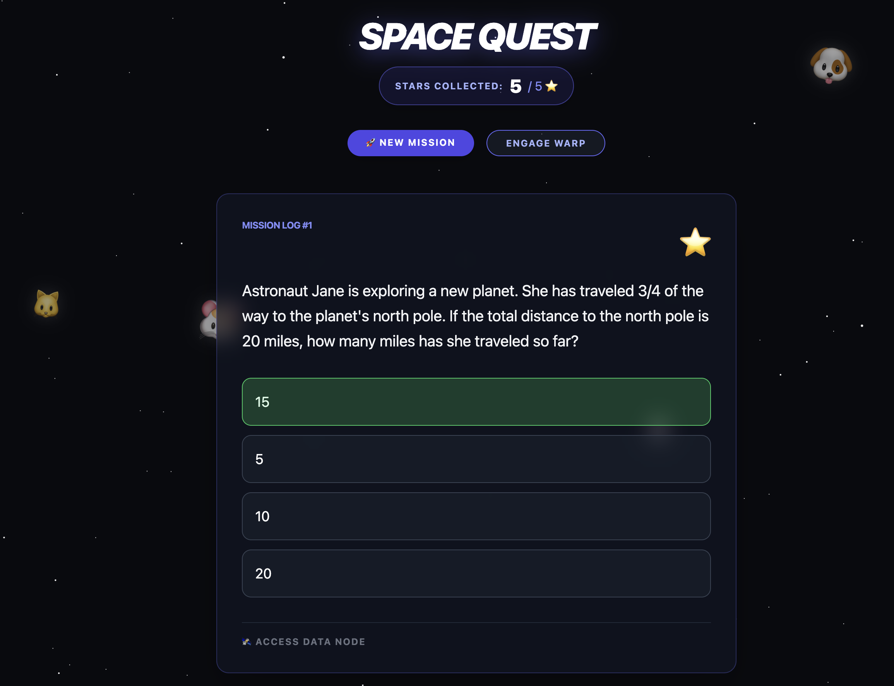

# 🚀 Space Fraction Quest



An interactive, web-based math learning platform designed for 5th-grade students. It combines **educational curriculum** (fractions) with a **Space Zoo** theme, utilizing **Kimi AI (Moonshot)** to dynamically generate fresh word problems and distractors every time.

## ✨ Features
* **AI-Powered Missions:** Leverages Moonshot AI to generate grade-appropriate fraction problems (addition, subtraction, multiplication, and division).
* **Interactive UI:** Multiple-choice questions with real-time feedback and a "Star Collection" score tracker.
* **Space Zoo Background:** A custom CSS-animated starfield featuring a drifting crew of space animals (🐱, 🐶, 🦊, 🐰, 🐹).
* **Warp Drive Mode:** A high-speed visual effect that accelerates the stars and animals for a "warp speed" experience.
* **Mobile-Ready:** Built with Tailwind CSS for a fully responsive layout.

---

## 📂 Project Structure

```text
math_games/
├── app.py              # Main Flask server & Jinja2 filter registration
├── engine.py           # Kimi AI integration, prompt logic, & data persistence
├── templates.py        # Centralized HTML/CSS/JS (The "Space Zoo" UI)
├── .env                # API Keys (KIMI_API_KEY)
├── .venv/              # Python virtual environment
└── output/
    └── quest_data.json # Locally cached AI-generated missions
```

---

## 🛠️ Getting Started

### 1. Prerequisites
* Python 3.10+
* A Moonshot AI (Kimi) API Key

### 2. Installation
```bash
# Clone the repository
git clone https://github.com/yourusername/space-fraction-quest.git
cd space-fraction-quest

# Set up virtual environment
python3 -m venv .venv
source .venv/bin/activate

# Install dependencies
pip install flask openai python-dotenv
```

### 3. Configuration
Create a `.env` file in the root directory:
```env
KIMI_API_KEY=your_kimi_api_key_here
```

### 4. Run the App
```bash
python app.py
```
Open your browser and navigate to `http://localhost:5001`.

---

## 🧠 Technical Highlights
* **Loop Scoping:** Implements explicit Jinja2 aliasing (``) to ensure stable ID targeting in nested loops.
* **Dynamic Shuffling:** Uses a custom Flask filter to scramble multiple-choice options on every page load.
* **State Management:** Client-side JavaScript manages score tracking and visual animations to minimize server load.

---

## 📜 License
MIT License - Feel free to use this for your own kids or classrooms!
